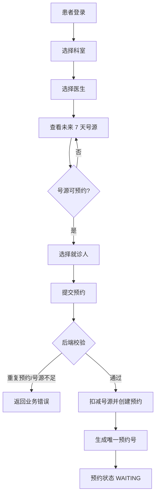
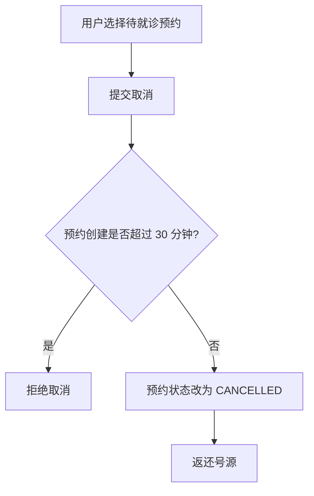

# 业务流程说明

## 挂号核心流程



## 取消预约流程



## 关键业务规则

- 号源只允许在 `AVAILABLE` 且剩余数量大于 0 时预约。
- 后端使用事务保证扣号和创建预约记录一致。
- 同一就诊人同一科室同一天只能预约一次。
- 预约成功后生成 `YYGH + 时间戳 + 随机串` 格式的预约号。
- 取消预约只允许在创建后 30 分钟内进行。
- 预约列表查询时会将过期的 `WAITING` 记录标记为 `COMPLETED`。

## 并发处理

两个用户同时预约最后一个号源时，后端不会只依赖先查询再判断，而是执行条件更新：

```sql
update schedule
set available_count = available_count - 1
where id = ? and status = 'AVAILABLE' and available_count > 0
```

只有更新成功的请求才能继续创建预约记录，更新失败则提示号源已满。
