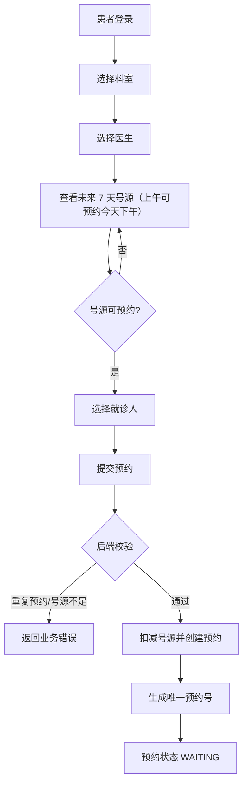
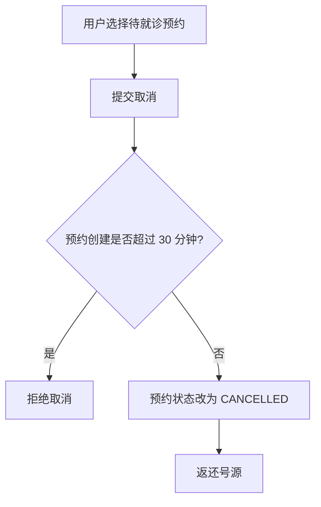
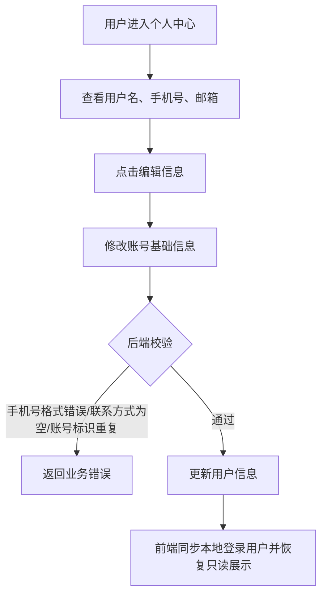
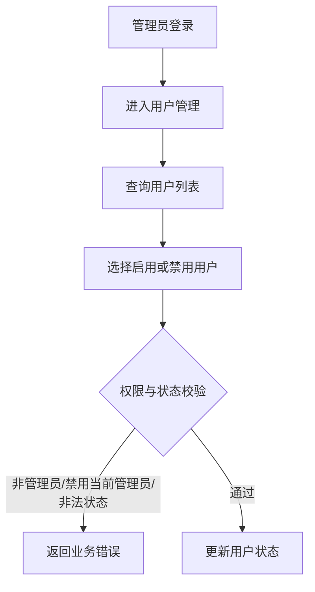

# 业务流程说明

## 挂号核心流程



## 取消预约流程



## 个人中心流程



## 管理员用户管理流程



## 关键业务规则

- 号源只允许在 `AVAILABLE` 且剩余数量大于 0 时预约。
- 当天上午号源需在 11:30 前预约，当天下午号源需在 17:30 前预约；超过截止时间后，后端拒绝提交并在号源查询中隐藏对应时段。
- 后端使用事务保证扣号和创建预约记录一致。
- 同一就诊人同一科室同一天只能预约一次。
- 预约成功后生成 `YYGH + 时间戳 + 随机串` 格式的预约号。
- 预约创建成功时模拟发送短信/邮件，将预约记录的 `notice_sent` 标记为 1。
- 取消预约只允许在创建后 30 分钟内进行。
- 预约列表查询时会将过期的 `WAITING` 记录标记为 `COMPLETED`。
- 普通用户不可见“管理统计”和“用户管理”模块。
- 个人中心默认只读，点击“编辑信息”后才允许修改用户名、手机号和邮箱。
- 用户手机号如填写，必须是以 1 开头的 11 位手机号；手机号和邮箱至少保留一个。
- 管理员用户管理需校验操作者为管理员，且不能禁用当前管理员账号。

## 并发处理

两个用户同时预约最后一个号源时，后端不会只依赖先查询再判断，而是执行条件更新：

```sql
update schedule
set available_count = available_count - 1
where id = ? and status = 'AVAILABLE' and available_count > 0
```

只有更新成功的请求才能继续创建预约记录，更新失败则提示号源已满。
