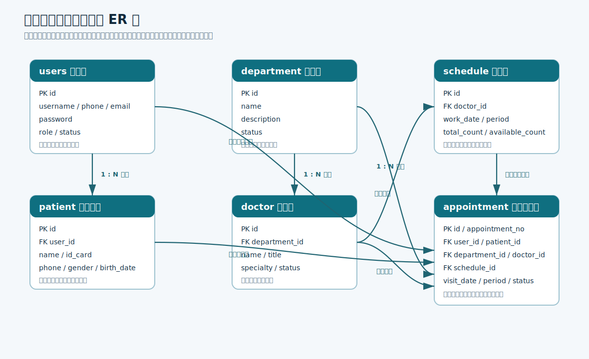
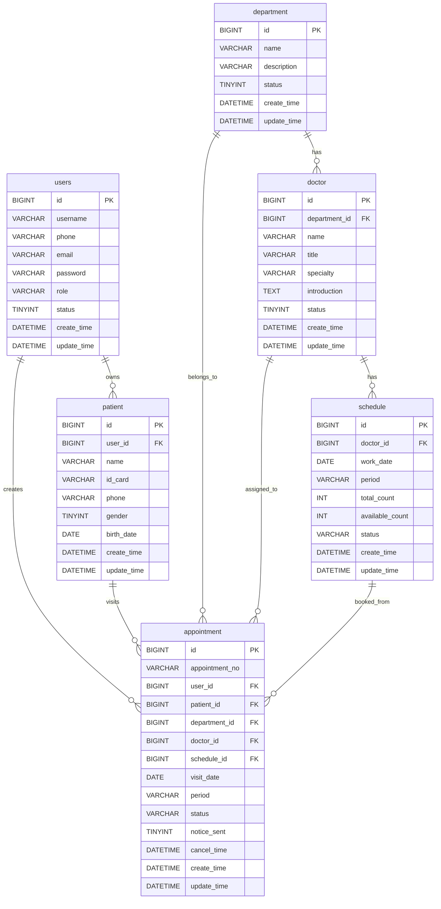

# 数据库设计

## ER 图

## 核心表

所有核心表均在初始化 SQL 中使用 `COMMENT` 标注表含义和字段含义。枚举类字段会在字段注释中写明取值范围，关键唯一索引用于兜底保证挂号业务规则。

### users 用户表

保存患者和管理员账号。关键字段：

| 字段 | 说明 |
| --- | --- |
| id | 用户 ID |
| username | 用户名 |
| phone | 手机号 |
| email | 邮箱 |
| password | 密码，演示项目使用明文 |
| role | `PATIENT` 或 `ADMIN` |
| status | 账号状态 |
| create_time | 创建时间 |
| update_time | 更新时间 |

索引：

- `uk_users_username` 保证用户名唯一。
- `uk_users_phone` 保证手机号唯一，支持手机号登录。
- `uk_users_email` 保证邮箱唯一，支持邮箱登录。

说明：

- 普通用户可在个人中心维护用户名、手机号和邮箱。
- 管理员可在用户管理中查看用户列表，并启用或禁用用户。

### patient 就诊人表

一个账号可添加多个就诊人。

| 字段 | 说明 |
| --- | --- |
| id | 就诊人 ID |
| user_id | 所属账号 |
| name | 姓名 |
| id_card | 身份证号 |
| phone | 手机号 |
| gender | 性别：`1` 男，`2` 女 |
| birth_date | 出生日期 |
| create_time | 创建时间 |
| update_time | 更新时间 |

索引：

- `idx_patient_user_id` 用于按账号查询就诊人。
- `uk_patient_id_card` 防止同一身份证重复录入。

### department 科室表

保存科室名称、介绍和启用状态。

| 字段 | 说明 |
| --- | --- |
| id | 科室 ID |
| name | 科室名称 |
| description | 科室介绍 |
| status | 科室状态：`1` 启用，`0` 停用 |
| create_time | 创建时间 |
| update_time | 更新时间 |

索引：

- `uk_department_name` 保证科室名称唯一，避免重复维护。

### doctor 医生表

医生归属一个科室，保存姓名、职称、专长、简介和状态。

| 字段 | 说明 |
| --- | --- |
| id | 医生 ID |
| department_id | 所属科室 ID |
| name | 医生姓名 |
| title | 医生职称，如主任医师、副主任医师、主治医师 |
| specialty | 医生专长 |
| introduction | 医生简介 |
| status | 医生状态：`1` 正常，`0` 停诊或停用 |
| create_time | 创建时间 |
| update_time | 更新时间 |

索引：

- `idx_doctor_department_id` 支持按科室查询医生。
- `idx_doctor_name` 支持医生搜索。

### schedule 号源排班表

每位医生每天上午、下午各一条号源。

| 字段 | 说明 |
| --- | --- |
| id | 号源 ID |
| doctor_id | 医生 ID |
| work_date | 出诊日期 |
| period | 出诊时段：`MORNING` 上午，`AFTERNOON` 下午 |
| total_count | 总号源数量 |
| available_count | 剩余号源数量 |
| status | 号源状态：`AVAILABLE` 可预约，`FULL` 已约满，`STOPPED` 停诊 |
| create_time | 创建时间 |
| update_time | 更新时间 |

索引：

- `uk_schedule_doctor_date_period` 保证同一医生同一天同一时段只有一条排班。
- `idx_schedule_doctor_id` 支持按医生查询未来号源。
- `idx_schedule_work_date` 支持按日期查询。
- `idx_schedule_status` 支持号源状态筛选。

约束：

- `chk_schedule_count` 保证 `total_count >= 0`、`available_count >= 0` 且 `available_count <= total_count`，避免非法号源数量。

### appointment 预约记录表

记录预约全生命周期。

| 字段 | 说明 |
| --- | --- |
| id | 预约 ID |
| appointment_no | 唯一预约号 |
| user_id | 预约账号 |
| patient_id | 就诊人 |
| department_id | 科室 |
| doctor_id | 医生 |
| schedule_id | 号源 |
| visit_date | 就诊日期 |
| period | 就诊时段：`MORNING` 上午，`AFTERNOON` 下午 |
| status | 预约状态：`WAITING` 待就诊，`CANCELLED` 已取消，`COMPLETED` 已完成 |
| notice_sent | 是否已模拟发送预约确认通知：`0` 未发送，`1` 已发送 |
| cancel_time | 取消时间 |
| create_time | 预约创建时间 |
| update_time | 更新时间 |

关键索引：

- `uk_appointment_no` 保证预约号唯一。
- `uk_patient_department_date(patient_id, department_id, visit_date)` 防止同一就诊人同一科室同一天重复预约。
- `idx_appointment_user_id` 支持查询我的预约。
- `idx_appointment_schedule_id` 支持追踪号源下的预约。
- `idx_appointment_status` 支持按预约状态筛选。
- `idx_appointment_visit_date` 支持每日预约量统计。

## 关键索引设计考虑

- 用户登录入口支持用户名、手机号、邮箱，因此 `users` 分别为三类账号标识建立唯一索引。
- 就诊人身份证号全局唯一，避免同一真实就诊人被重复录入。
- 医生排班通过 `uk_schedule_doctor_date_period` 约束同一医生同一天同一时段只能有一条号源记录。
- 预约表通过 `uk_patient_department_date` 在数据库层兜底防止重复预约，即使并发请求绕过服务层预检查，也会被唯一索引拦截。
- 预约号通过 `uk_appointment_no` 保证全局唯一，便于患者凭预约号查询或到院取号。
- 常用列表和统计场景分别使用 `idx_appointment_user_id`、`idx_appointment_schedule_id`、`idx_appointment_visit_date` 提升查询效率。
