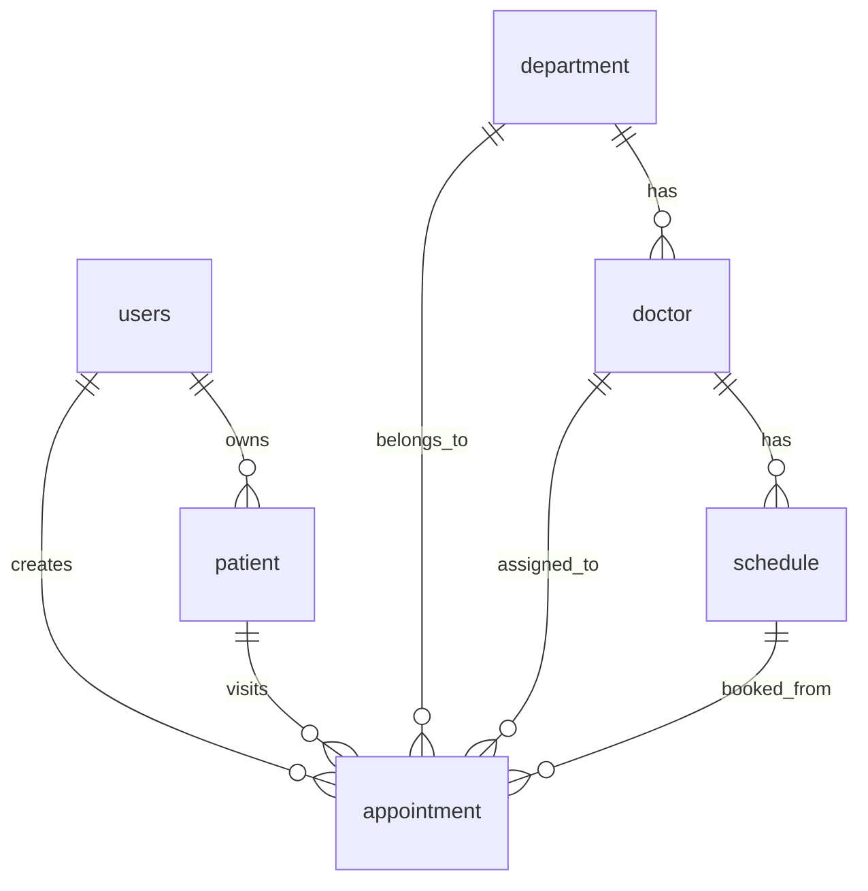

# 数据库设计

## ER 图

## 核心表

### users 用户表

保存患者和管理员账号。关键字段：

| 字段 | 说明 |
| --- | --- |
| id | 用户 ID |
| username | 用户名 |
| phone | 手机号 |
| email | 邮箱 |
| password | 密码，演示项目使用明文 |
| role | `PATIENT` 或 `ADMIN` |
| status | 账号状态 |

索引：

- `uk_users_username`
- `uk_users_phone`
- `uk_users_email`

### patient 就诊人表

一个账号可添加多个就诊人。

| 字段 | 说明 |
| --- | --- |
| id | 就诊人 ID |
| user_id | 所属账号 |
| name | 姓名 |
| id_card | 身份证号 |
| phone | 手机号 |
| gender | 性别 |
| birth_date | 出生日期 |

索引：

- `idx_patient_user_id` 用于按账号查询就诊人。
- `uk_patient_id_card` 防止同一身份证重复录入。

### department 科室表

保存科室名称、介绍和启用状态。

### doctor 医生表

医生归属一个科室，保存姓名、职称、专长、简介和状态。

索引：

- `idx_doctor_department_id` 支持按科室查询医生。
- `idx_doctor_name` 支持医生搜索。

### schedule 号源排班表

每位医生每天上午、下午各一条号源。

| 字段 | 说明 |
| --- | --- |
| doctor_id | 医生 ID |
| work_date | 出诊日期 |
| period | `MORNING` 或 `AFTERNOON` |
| total_count | 总号源数量 |
| available_count | 剩余号源数量 |
| status | `AVAILABLE`、`FULL`、`STOPPED` |

索引：

- `uk_schedule_doctor_date_period` 保证同一医生同一天同一时段只有一条排班。
- `idx_schedule_work_date` 支持按日期查询。
- `idx_schedule_status` 支持号源状态筛选。

### appointment 预约记录表

记录预约全生命周期。

| 字段 | 说明 |
| --- | --- |
| appointment_no | 唯一预约号 |
| user_id | 预约账号 |
| patient_id | 就诊人 |
| department_id | 科室 |
| doctor_id | 医生 |
| schedule_id | 号源 |
| visit_date | 就诊日期 |
| period | 就诊时段 |
| status | `WAITING`、`CANCELLED`、`COMPLETED` |
| notice_sent | 是否已模拟通知 |
| cancel_time | 取消时间 |

关键索引：

- `uk_appointment_no` 保证预约号唯一。
- `uk_patient_department_date(patient_id, department_id, visit_date)` 防止同一就诊人同一科室同一天重复预约。
- `idx_appointment_user_id` 支持查询我的预约。
- `idx_appointment_schedule_id` 支持追踪号源下的预约。
