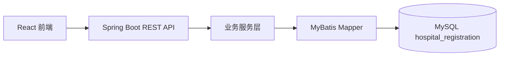

# 在线挂号系统项目说明

## 技术选型及原因

- 前端：React + JavaScript + Vite。适合快速构建前后端分离的交互式挂号流程，代码结构直观，便于演示和二次修改。
- 后端：Spring Boot + MyBatis。Spring Boot 便于快速暴露 RESTful API，MyBatis 对 SQL 可控性强，适合表达号源扣减、唯一约束等关键业务规则。
- 数据库：MySQL。挂号系统天然是结构化关系数据，用户、就诊人、医生、号源、预约记录之间关系清晰，MySQL 事务和唯一索引能支撑基础一致性。

## 项目架构图



## 核心业务规则

- 一个账号可以维护多个就诊人。
- 每位医生未来 7 天每天上午、下午各一条号源。
- 号源状态分为 `AVAILABLE`、`FULL`、`STOPPED`。
- 同一就诊人同一科室同一天只能预约一次。
- 预约成功后状态为 `WAITING`，并模拟通知发送，将 `notice_sent` 标记为 1。
- 预约创建后 30 分钟内允许取消，超过后不可取消。
- 取消预约后返还号源，若原状态为约满则恢复为可预约。

## 数据一致性考虑

提交预约是本系统最关键的接口。实现上使用数据库事务包住完整流程：

1. 校验就诊人归属当前账号。
2. 查询号源状态。
3. 检查同一就诊人同一科室同一天是否已有预约。
4. 使用一条原子 SQL 扣减号源：

```sql
update schedule
set available_count = available_count - 1
where id = ? and status = 'AVAILABLE' and available_count > 0
```

5. 创建预约记录。

即使两个用户同时抢最后一个号源，也只有一个事务能成功扣减。预约表还通过唯一索引 `uk_patient_department_date(patient_id, department_id, visit_date)` 兜底防重复预约。

## AI 编程工具使用体会

本项目开发过程中使用了 Codex 辅助阅读题目、生成基础代码结构和文档初稿。AI 可以提高样板代码、接口文档和前端布局的完成效率，但医疗挂号业务不能完全依赖生成结果。

我对 AI 生成的业务逻辑做了以下修正和优化：

- 将“号源扣减”放在后端事务内，并使用数据库条件更新，避免前端判断导致超卖。
- 将“同一就诊人同一科室同一天只能预约一次”同时放在服务层校验和数据库唯一索引中。
- 取消预约不只是修改预约状态，还会返还号源，并且严格限制 30 分钟规则。
- 管理员排班修改限制 `available_count <= total_count`，避免产生非法号源数据。
- 前端只负责流程选择与展示，关键校验全部由后端执行。

这些调整保证了代码更符合真实医疗挂号场景中对严谨性、一致性和可追溯性的要求。
