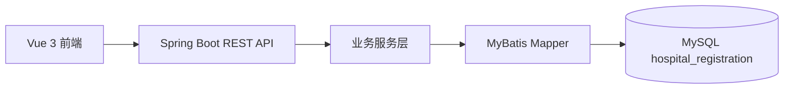

# 在线挂号系统项目说明

## 技术选型及原因

- 前端：Vue 3 + TypeScript + Vite。适合构建前后端分离的交互式挂号流程，TypeScript 能提前约束用户、医生、号源、预约记录等接口数据结构，减少字段误用。
- 后端：Spring Boot + MyBatis。Spring Boot 便于快速暴露 RESTful API，MyBatis 对 SQL 可控性强，适合表达号源扣减、唯一约束等关键业务规则。
- 数据库：MySQL。挂号系统天然是结构化关系数据，用户、就诊人、医生、号源、预约记录之间关系清晰，MySQL 事务和唯一索引能支撑基础一致性。

## 功能概述

系统采用前后端分离模式，实现门诊预约挂号的核心流程：

- 用户注册、登录，支持用户名、手机号或邮箱登录。
- 个人中心，已登录用户可查看并编辑用户名、手机号和邮箱。
- 就诊人管理，一个账号可维护本人或家属就诊信息。
- 科室、医生、号源查询，支持按科室或医生关键字搜索。
- 提交预约，预约成功后进入单独成功页，并在“我的预约”中查看记录。
- 预约取消，创建后 30 分钟内允许取消，取消后返还号源。
- 管理统计，管理员可查看预约统计、热门科室，并基于全部科室维护医生未来日期号源。
- 用户管理，管理员可查看用户列表，并启用或禁用用户；系统限制不能禁用当前管理员账号，普通用户不可见管理统计和用户管理模块。

## 项目架构图



## 代码结构

```text
hospital-registration-system
├── backend                     Spring Boot 后端服务
│   ├── src/main/java/com/hospital/backend
│   │   ├── controller           REST API 控制层
│   │   ├── service              业务逻辑层
│   │   ├── mapper               MyBatis 数据访问层
│   │   ├── entity               数据实体
│   │   ├── dto                  请求参数对象
│   │   └── common               统一响应和异常处理
│   └── 数据库初始化脚本/init.sql
├── frontend                    Vue 3 + TypeScript 前端
│   └── src
│       ├── views                页面级组件
│       ├── components           通用组件
│       ├── api.ts               API 请求封装
│       └── types.ts             前端类型定义
└── docs                        API、数据库和业务流程文档
```

## 核心业务规则

- 一个账号可以维护多个就诊人。
- 每位医生未来 7 天每天上午、下午各一条号源。
- 当天上午号源需在 11:30 前预约，当天下午号源需在 17:30 前预约，超过截止时间后不再允许提交。
- 号源状态分为 `AVAILABLE`、`FULL`、`STOPPED`。
- 同一就诊人同一科室同一天只能预约一次。
- 预约成功后状态为 `WAITING`，并模拟通知发送，将 `notice_sent` 标记为 1。
- 预约创建后 30 分钟内允许取消，超过后不可取消。
- 取消预约后返还号源，若原状态为约满则恢复为可预约。

## 数据一致性考虑

提交预约是本系统最关键的接口。实现上使用数据库事务包住完整流程：

1. 校验就诊人归属当前账号。
2. 查询号源状态。
3. 检查同一就诊人同一科室同一天是否已有预约。
4. 使用一条原子 SQL 扣减号源：

```sql
update schedule
set available_count = available_count - 1
where id = ? and status = 'AVAILABLE' and available_count > 0
```

5. 创建预约记录。

即使两个用户同时抢最后一个号源，也只有一个事务能成功扣减。预约表还通过唯一索引 `uk_patient_department_date(patient_id, department_id, visit_date)` 兜底防重复预约。

## AI 编程工具使用体会

本项目开发过程中使用了 Codex 辅助阅读题目、生成基础代码结构和文档初稿。我认为 AI 编程工具在项目开发中具有重要作用，它可以帮助快速梳理需求、生成基础代码和文档初稿，从而减少重复性编码时间、提升开发效率。但在在线挂号这类涉及业务规则和数据一致性的系统中，仍需要理解业务场景，对 AI 生成结果进行审查、验证和修正，确保代码逻辑可靠。

我对 AI 生成的业务逻辑做了以下修正和优化：

- 将“号源扣减”放在后端事务内，并使用数据库条件更新，避免前端判断导致超卖。
- 将“同一就诊人同一科室同一天只能预约一次”同时放在服务层校验和数据库唯一索引中。
- 取消预约不只是修改预约状态，还会返还号源，并且严格限制 30 分钟规则。
- 管理员排班修改限制 `available_count <= total_count`，避免产生非法号源数据。
- 前端只负责流程选择与展示，关键校验全部由后端执行。

这些调整保证了代码更符合真实医疗挂号场景中对严谨性、一致性和可追溯性的要求。

## 配套文档

- 运行指南：`运行指南.md`
- API 文档：`docs/API文档.md`
- 数据库设计：`docs/数据库设计.md`
- 业务流程说明：`docs/业务流程说明.md`
